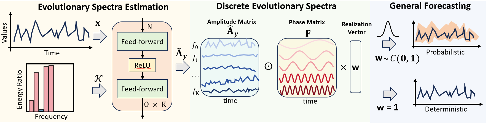

This is the official repo of "TimeES: General Time Series Forecasting via Evolutionary Spectra" 

# 1 TimeES
TimeES is a first attempt to use evolutionary spectra theory for point and probabilistic forecasting. 

<p align="center">
  
</p>


# 2 install requirements

```
pip install -r ./requirements.txt
```

# 3 run
The dataset will be downloaded automatically

see ./scripts/ for examples.

```python
bash ./scripts/TimeES/ProbForecast/ETTh1.sh
```


